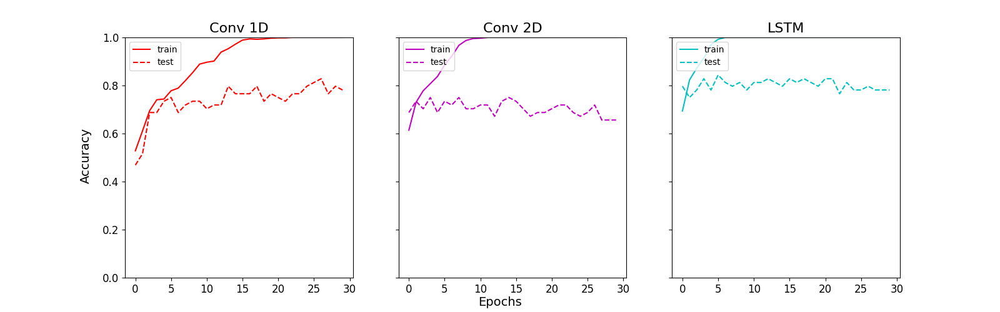

# OrcaClassifier using LSTM with DVC pipelining and GitHub action
  An approach is made to classify orca calls using recurrent neural networks in comparison to conventional convolutional neural networks with CI/CD in action using cml.
- tar.gz files are downloaded from remote storage which is data versioned by DVC
- dvc.yaml executed using `dvc repro` this runs the complete pipeline of execution from extracting tar files to their preprocessing and model training.
- To run the preprocessing.py alone run:  `python scripts/preprocessing/preprocess.py --tsv_path <path/to/data_csv>  --files_dir <path/to/wav_files>`(Fow Windows)  `python3 scripts/preprocessing/preprocess.py --tsv_path <path/to/data_csv>  --files_dir <path/to/wav_files>`(For linux)  Add `--reduce_noise` to remove background noise from the extracted calls.
- The model has been created with Kapre ( **K**eras **A**udio **Pre**processing ) at the first layer, it computes STFT, ISTFT, Melspectrogram, and others on GPU real-time. For more info see [keunwoochoi/kapre](https://github.com/keunwoochoi/kapre).
- To view the summary of the models run:  `python scripts/models.py --summary(-sum)` (For Windows)  `python3 scripts/models.py --summary(-sum)` (For Linux)
- To train the model alone from the available options [conv1,conv2,lstm] run:  `python scripts/train.py --model_type <model_name_from_list>`(For Windows) `python scripts/train.py --model_type <model_name_from_list>`(For linux)  Add --plt_grph(-pg), --force(-f) for plotting the graphs for all the models and for forcefully training even when previously trained respectively. **Note**: 1. For the plotting the metrics for all the models must be present in logs directory else the result would be faulty. 2. Without `--force` by the default command, the models will train only if not trained previously.
- Three models have been created for a better comparison of there respective metrics, the main objective here is to make the LSTM model perform the best, a 1-D Convolutional Network and a 2-D Convolutional Network have been created for the same.
- The output metrics to instantiate the training procedure: 

